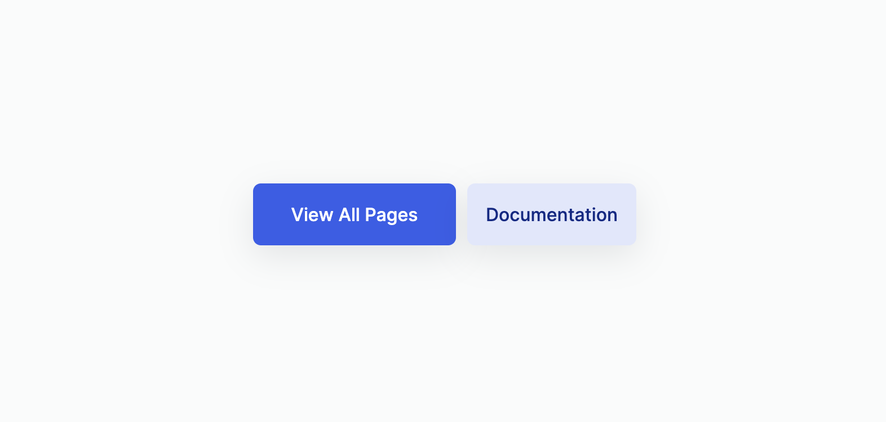

# What you've learned

-   ...
-   ...

# Subjective

```html
<div class="btn_wrapper">
    <button class="btn view_more_btn">view all pages</button>
    <button class="btn documentation_btn">documentation</button>
</div>
```

# Result


