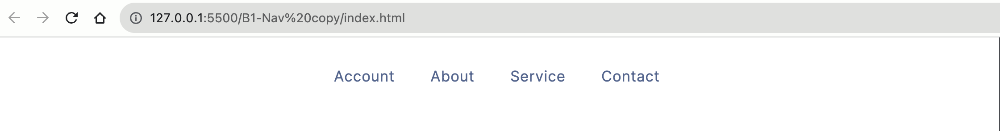

# What you've learned

-   ...
-   ...

# Subjective

```html
<ul class="nav_menu_list">
    <li class="nav_menu_item">
        <a href="#" class="nav_menu_link">account</a>
    </li>
    <li class="nav_menu_item">
        <a href="#" class="nav_menu_link">about</a>
    </li>
    <li class="nav_menu_item">
        <a href="#" class="nav_menu_link">service</a>
    </li>
    <li class="nav_menu_item">
        <a href="#" class="nav_menu_link">contact</a>
    </li>
</ul>
```

# Result


