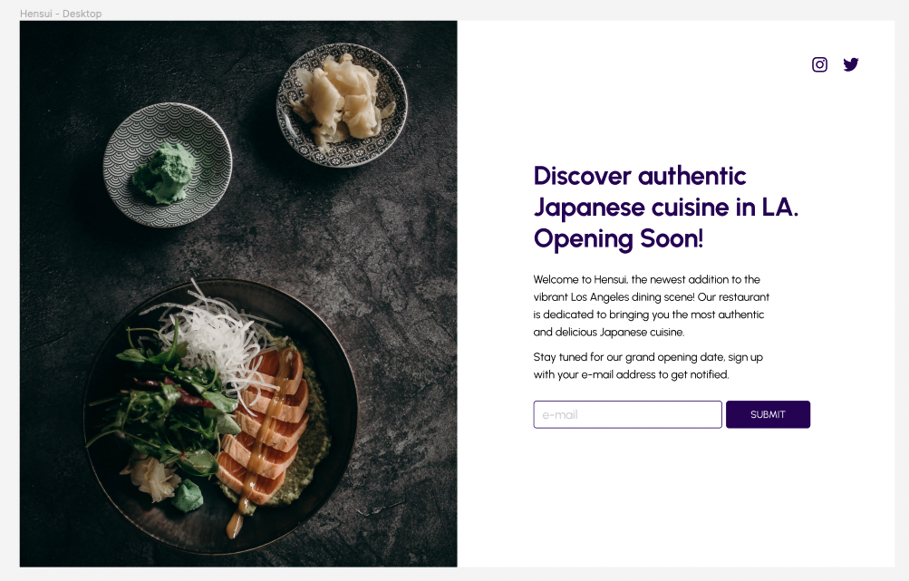

# What you've learned

-   ...
-   ...

# Subjective

-   สร้าง App Component สำหรับ Render Component ทั้งหมดที่สร้างมาเป็น 1 หน้าเว็บไชต์
-   Challenge : สร้าง Component สำหรับ Logo

# Result

[figma](<https://www.figma.com/file/pYPoXyuTFZ1FBvn5teIz8D/XIDE-Hensui---Business-Landing-Page-UI-Template-(Community)-(Copy)?type=design&node-id=302-251&mode=design&t=6UNGU3b74ukUNVuD-0>)  
[image](https://i.ibb.co/9VZRsxF/pexels-cottonbro-studio-3296546-1.png)

