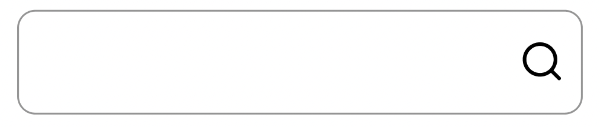

# What you've learned

-   ...
-   ...

# Subjective

-   สร้าง Component ที่ชื่อว่า SearchBar ตาม figma

# Result

[figma](<https://www.figma.com/file/Hx6YVIJzNJtBrKknVOHxhw/eCommerce-Website-%7C-Web-Page-Design-%7C-UI-KIT-%7C-Interior-Landing-Page-(Community)?type=design&node-id=63-107&mode=design&t=abswAYzUQM5vw1o8-0>)

[image link](https://i.ibb.co/8Bych3q/icons8-search-120.png)  

